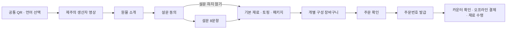
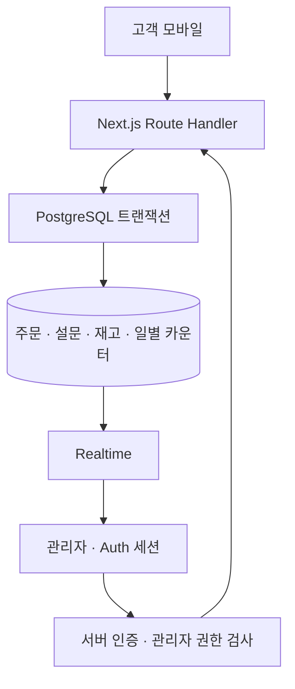

# 제주소풍 · 주세요

제주소풍 매장에서 **재료를 고르고 직접 김밥을 만드는 체험**을 위한 모바일 주문 웹입니다. 고객은 공통 QR로 접속해 설문과 재료 선택을 마치고 주문번호를 받습니다. 직원은 카운터에서 주문을 확인하고 오프라인 결제와 재료 수령을 처리합니다.

현재는 실제 고객을 받기 전 **내부 테스트 단계**입니다. 동의문은 미확정 상태로 비워두고 설문 가안 8문항을 테스트합니다. 온라인 결제·고객 회원가입·원물 추천은 포함하지 않습니다.

테스트 접속: [고객 주문](https://jeju-sopoong.vercel.app) · [관리자](https://jeju-sopoong.vercel.app/admin) · [검증 결과](docs/검증결과.md)

## 이용 흐름



고객 화면은 `/`, 관리자 화면은 `/admin`입니다. 관리자에는 운영, 재고·메뉴, 연구 데이터, 공통 QR, 계정 관리 탭이 있습니다.

## 기술 선택

| 영역 | 구성과 이유 |
|---|---|
| 웹 | Next.js App Router + TypeScript strict: 고객 화면과 서버 API를 한 프로젝트에서 관리 |
| UI | React 상태 + 브라우저 저장소, Tailwind CSS와 직접 작성한 CSS: 의존성 최소화 |
| DB | Supabase PostgreSQL 서울: 트랜잭션으로 재고·채번·주문을 함께 처리 |
| 인증 | Supabase Auth + 관리자 ID 허용 목록: 일반 로그인 사용자와 매장 관리자 구분 |
| 실시간 | Supabase Realtime + 10초 자동 조회: 새 주문 반영과 이벤트 누락 보완 |
| 배포 | Vercel 서울 `icn1`, Node.js 22: GitHub `main`에서 배포하고 계정 이관 지원 |



## 로컬 실행

```bash
nvm use
npm ci
cp .env.example .env.local
# .env.local에 Supabase 프로젝트 연결 값을 직접 입력합니다.
npm run dev
```

실제 키를 터미널 기록·채팅·커밋에 넣지 않습니다. `npm run dev` 실행 후 `http://localhost:3000`에 접속합니다. 파일 감시 한도가 낮은 환경에서는 다음 명령을 사용합니다.

```bash
WATCHPACK_POLLING=true npm run dev -- --webpack
```

외부 Supabase가 없어도 화면 구조는 확인할 수 있지만 주문 확정은 비활성화됩니다. 로컬에서 DB까지 테스트하려면 Docker를 실행한 뒤:

```bash
npx supabase start
npx supabase status
```

출력의 로컬 URL·anon·service_role 값을 **`.env.development.local`**에 설정합니다. 변수 이름은 `.env.example`과 동일합니다. 이 파일은 개발 서버에서 `.env.local`보다 우선합니다. 로컬 테스트 도우미는 로컬 주소를 확인한 후 가상 관리자와 재고를 준비합니다.

```bash
node scripts/setup-local-test.mjs
```

가상 계정 값은 `/tmp/jeju-local-admin.json`에만 저장합니다. 실제 고객·매장 계정은 테스트 스크립트에 넣지 않습니다.

## 환경변수와 관리자

필수 변수와 발급 위치는 [`.env.example`](.env.example)에 있습니다.

- `NEXT_PUBLIC_SUPABASE_URL`, `NEXT_PUBLIC_SUPABASE_ANON_KEY`: 브라우저와 서버 연결.
- `SUPABASE_SERVICE_ROLE_KEY`: 서버 전용. `NEXT_PUBLIC_` 접두사를 붙이지 않습니다.
- `INTERNAL_TEST_MODE=true`: 미확정 동의문으로 내부 설문 테스트. 실제 고객 운영 시 확정 동의문을 등록하고 `false`로 재배포합니다.

관리자 생성에는 `.env.admin.local`의 `ADMIN_USERNAME`, `ADMIN_PASSWORD`를 사용합니다. 아이디는 영문·숫자·점·밑줄·하이픈 3~40자, 비밀번호는 5~200자로 설정하고 다음을 실행합니다.

```bash
npm run admin:create
```

아이디와 비밀번호는 관리자 **계정 관리** 화면에서 현재 비밀번호를 확인한 후 함께 변경할 수 있습니다. 로그인 아이디는 Auth 내부 주소와 연결되며 비밀번호 원문은 DB에 저장하지 않습니다. 계정 값은 코드나 시드에 포함되지 않습니다. `.env*local`은 Git에서 제외됩니다. 공개 회원가입을 비활성화하고 공용 관리자 계정 하나로 운영합니다.

## DB 구축과 설문 교체

`supabase/migrations/`를 순서대로 적용한 뒤 `supabase/seed.sql`을 실행하면 빈 DB에서 재구축할 수 있습니다. [이관 절차](docs/이관절차.md)에 실제 명령이 있습니다. 시드는 기존 가격·재고·콘텐츠를 덮어쓰지 않습니다.

설문은 DB의 `survey_versions.questions` JSON을 읽어 표시합니다. 단일·복수·단답, 필수 여부, 배타 선택지와 `linkedIngredientId`를 지원합니다. 가안 원본은 `config/survey.json`이며 `npm run seed:generate`로 신규 구축용 시드를 다시 만들 수 있습니다.

운영 중 문항을 바꿀 때는 기존 버전을 수정하지 않고 새 ID로 등록한 뒤 한 트랜잭션에서 기존 버전을 비활성화하고 새 버전을 활성화합니다. 진행 중인 고객은 새 문항을 다시 확인해야 합니다. 주문은 사용한 설문 버전을 보관합니다. 설문 수정 후 기존 장바구니는 유지하고 새 구성에 최신 재료 제외 기본값을 적용합니다.

## 일상 운영

1. **영업 전:** Supabase 프로젝트 상태를 확인하고 토핑별 수량을 입력합니다. 초기 시드 재고는 0입니다.
2. **영업 중:** 운영 탭에서 숫자 입력 후 Enter로 주문을 선택합니다. 숫자 입력이 없을 때 Enter는 선택 주문의 결제·수령 완료입니다.
3. 완료 후 5초 동안 실행 취소 또는 `Ctrl+Z`로 접수 상태로 되돌립니다. `↑↓` 이동, `N` 수기 주문, `C` 취소, `?` 안내를 지원합니다. 입력란에서는 단축키가 작동하지 않습니다.
4. 취소는 확인과 사유 입력 후 최종 처리하며, 토핑 재고를 한 번만 복구합니다.
5. **영업 후:** 연구 데이터 탭에서 오늘·최근 일주일·최근 한달 또는 직접 지정한 기간, 설문 참여 여부, 포함 재료로 조회합니다. 주문·설문 CSV, 구성별 CSV, 전체 JSON, 문항 코드표를 내려받을 수 있습니다.

기본 김밥 5,000원, 토핑별 3,000원입니다. 기본 재료를 빼도 가격은 같습니다. 패키지는 10,000원 추가이며 토핑 값도 더합니다. 패키지는 활성화되어 담기 전에 추가 여부를 선택합니다. 라면·음료·굿즈의 개별 추가 상품은 비활성이고 미정 가격을 임의로 넣지 않습니다.

콘텐츠 관리 UI는 제공하지 않습니다. 유지보수 담당자가 `contents` 테이블의 `producer` 영상 URL과 원물 설명을 직접 수정합니다. 원물 소개 순서는 제주 돼지고기 → 뿔소라 → 고사리 → 당근입니다. 생산자 영상과 원물 소개는 건너뛰기를 지원하고, 원물 뒤로가기는 직전 원물로 이동합니다. 설문 미참여 주문은 답변·동의·설문 버전을 비워 저장합니다.

## 주요 기술적 판단

- **재고 동시성:** 클라이언트 금액을 믿지 않고 DB가 가격을 계산합니다. 가격 행과 재고 행을 잠그며 재고 검증·차감·채번·저장을 한 트랜잭션으로 처리합니다.
- **중복 제출:** 제출 UUID를 유지하고 같은 UUID의 동시 요청을 직렬화해 중복 주문을 막습니다. 네트워크 오류 후 같은 요청을 다시 보내면 기존 주문을 반환합니다.
- **KST 번호:** 영업일은 `Asia/Seoul`로 계산합니다. 날짜별 카운터를 원자적으로 증가시키며 날짜·번호에 유일성 제약을 둡니다. 번호는 대기순서가 아닌 식별자입니다.
- **복원:** 주문 완료 시 날짜·번호·저장 시각만 localStorage에 저장합니다. 내역은 서버에서 다시 읽고 저장 후 4시간 또는 저장 기기의 KST 날짜 변경 시 만료합니다. DB 영업일은 조회 키로만 사용하므로 기기와 서버 날짜가 달라도 완료 직후 사라지지 않습니다. 공개 조회는 설문·동의 데이터를 반환하지 않습니다.
- **과거 데이터 보존:** 주문 당시 가격·재료 이름·포함 및 제외 구성을 스냅샷으로 저장합니다. 메뉴 가격 변경은 과거 주문에 영향을 주지 않습니다.
- **카운터 조작:** 번호 검색과 완료의 Enter 동작을 구분하고, 완료만 짧게 되돌릴 수 있게 했습니다. 변경 버전을 확인해 다른 관리자가 바꾼 상태를 덮어쓰지 않습니다.

## 검증

```bash
npm run test
npm run lint
npm run typecheck
npm run build
# 로컬 Supabase가 실행 중일 때: 별도 임시 DB를 생성해 검증하고 삭제합니다.
npm run test:db
# 로컬 개발 서버와 테스트 계정 준비 후
node scripts/test-api.mjs
```

DB 테스트는 마지막 재고 동시 주문, 같은 제출의 중복 차감 방지, 취소 복구, 부분 실패 롤백, 가격 조작·비활성 상품 거절, 상태 버전 충돌, RLS와 KST를 검증합니다. API 테스트는 인증, 설문 연결, 공개 조회 제한, CSV, QR, 상태 실행 취소를 검증합니다.

## 배포와 QR

GitHub 저장소를 Vercel에 연결하고 Production Branch를 `main`, Node.js를 22.x로 설정합니다. Supabase 환경변수 네 개를 Vercel에 등록하고 배포합니다. 서울 리전은 `vercel.json`에 지정되어 있습니다. 개발자 로컬의 `.env.development.local`과 관리자 비밀번호 파일은 배포하지 않습니다.

관리자 운영 탭의 공통 QR을 화면에 띄워 테스트할 수 있습니다. 파일로 생성하려면:

```bash
npm run qr -- "https://배포주소/" public/qr.png
```

**QR 인쇄 뒤 도메인이 바뀌면 QR을 다시 인쇄해야 합니다.** 커스텀 도메인을 확정한 뒤 인쇄합니다.

## 장애 대응과 비용

- 접속 장애 때는 종이에 재료 구성과 금액을 기록하고 카운터에서 처리합니다. 인터넷 복구 후 수기 주문으로 등록합니다. 웹에는 오프라인 동기화 기능이 없습니다.
- 주문 확정 응답이 끊겼다면 새 주문을 만들기 전에 같은 화면에서 다시 시도하거나 관리자에서 접수 여부를 확인합니다.
- Supabase Free는 비활성 기간이 길면 일시정지될 수 있습니다. 영업 전에 대시보드 상태를 확인합니다. 무료 프로젝트 수·DB 용량·전송량·Realtime 사용량과 백업 필요에 따라 유료 전환을 판단합니다. [공식 요금 안내](https://supabase.com/pricing)
- Vercel Hobby는 비상업적 개인 사용으로 제한됩니다. **매장의 상업적 운영에는 Pro 등 허용되는 요금제를 준비해야 합니다.** 무료 사용량만으로 운영 가능 여부를 판단하지 않습니다. [Hobby 공식 조건](https://vercel.com/docs/plans/hobby)
- 복구가 필요하면 Vercel의 이전 정상 배포로 롤백합니다. DB 변경은 배포 롤백으로 되돌아가지 않으므로 마이그레이션 호환성과 백업을 확인합니다.

## 소유권과 이관

[이관 절차](docs/이관절차.md)에 DB 백업·복원, 환경변수 교체, 관리자 재생성, GitHub·Vercel 소유권 이전, 도메인 연결과 인수 점검을 정리했습니다.

**브랜드 로고와 일러스트는 제주소풍의 자산이며 코드 라이선스에 포함되지 않습니다.** 제공된 원본은 `assets/brand/`, 웹용 복사본은 `public/brand/`에 있습니다. 코드 라이선스는 아직 지정하지 않았습니다.
