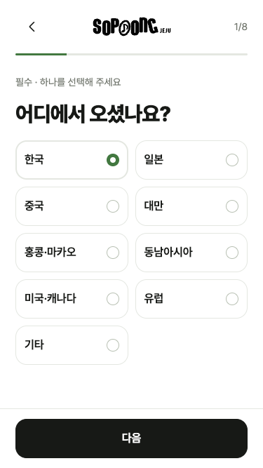
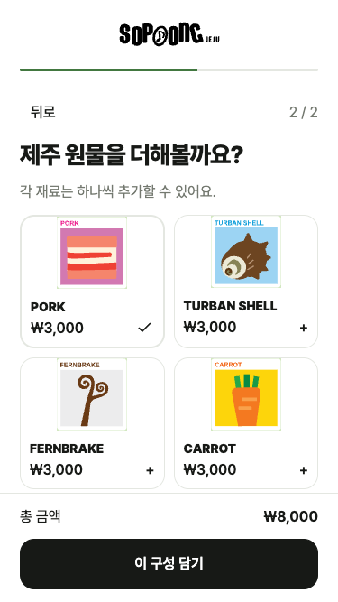
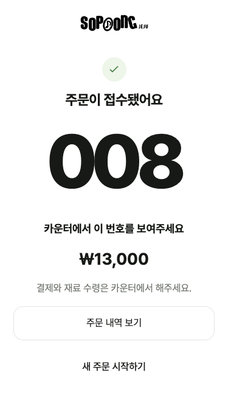

# 내부 테스트 검증 결과

2026-09-07 구현 기준입니다. 실제 고객 데이터는 사용하지 않았습니다.

## 자동 검증

- Node.js 22 타입 검사, ESLint, 프로덕션 빌드 통과.
- 도메인 테스트 5개 통과: 가격, 설문 배타 선택, 재료 기본값, KST 및 저장 만료, CSV 안전 처리.
- 격리 PostgreSQL 통합 검사 21개 통과: 마지막 재고 동시 주문, 중복 제출, 중복 취소, 전체 롤백, 가격 변경, 18,000원 패키지, 완료 실행 취소, 권한 차단, KST 채번.
- 로컬 API 검사 통과: 관리자 인증, 동의·설문 필수 검증, 주문과 설문 연결, 공개 조회 응답 제한, CSV, QR, 완료 실행 취소.
- 배포용 브라우저 번들에 실제 Supabase service-role 키가 포함되지 않았음을 확인.

## 화면 검증

Playwright Chromium의 375×667 및 430px 화면에서 전체 고객 흐름을 실행했습니다. 설문 새로고침 복원, S8 배타 선택, 계란 자동 제외·수동 재선택, 새 구성 기본값, 여러 항목 13,000원 합계, 완료 번호 새로고침 복원을 확인했습니다. 가로 넘침은 없었습니다.

관리자 브라우저에서 고객 주문의 실시간 수신, 재고 차감, 완료 및 실행 취소를 확인했습니다.

| 설문 | 토핑 | 주문 완료 |
|---|---|---|
|  |  |  |

화면 시안과 비교해 좁은 고객 화면, 큰 제목과 주문번호, 흑백 기반·연녹색 선택 표시, 둥근 카드와 하단 진행 버튼을 적용했습니다. 제품 문구와 이미지는 원본 요청서·브랜드 자산을 우선했습니다. 667px 높이에서는 토핑 카드 간격을 줄여 하단 버튼과 겹치지 않게 했고 일러스트 전체가 보이도록 표시했습니다.

## 클라우드 배포 확인

Vercel Production 배포 `dpl_iVtMBJbJEeFdRVAQqQ7uvnWPBrYy`가 READY 상태이며 `https://jeju-sopoong.vercel.app`에 연결됐습니다. 고객·관리자 화면 200 응답, 8문항 카탈로그, 인증 없는 관리자 API 401, 지정 관리자 로그인·주문 조회, QR PNG 응답을 확인했습니다. 기본 김밥 5,000원 주문의 설문 연결·공개 조회·관리자 완료 처리를 실제 클라우드에서 확인했습니다. 테스트 주문은 DB 기준 영업일 `2026-09-09`, 번호 `001`이며 삭제하지 않았습니다. 로컬 장비 날짜와 클라우드 시계가 달랐고 영업일은 DB 서버의 KST 계산 결과입니다.

## 현장 확인 항목

실제 휴대폰과 매장 관리자 기기 두 대의 동시 주문, 매장 네트워크 단절·복구, QR 인쇄물 스캔은 현장에서 확인해야 합니다. 브라우저 모바일 크기 검증은 실제 휴대폰 검증을 대신하지 않습니다. 클라우드 재고 초깃값은 0이므로 테스트 전에 관리자가 입력합니다. 실제 고객 운영 전 확정 동의문과 호스팅 요금제 확인이 필요합니다.

## 고객 흐름·연구 데이터 개편 검증 (2026-09-08)

- 고객: 주세요 배지, 한국어 기본 선택, 생산자 영상, 원물 순서·뒤로가기, 설문 건너뛰기, 패키지 15,000원, 추가 주문, 완료 번호 새로고침 복원 확인.
- 연구: 참여·미참여 필터, 주문·설문 CSV/구성 CSV/JSON/문항 코드표, 미응답과 비선택 구분 검증. 자세한 구조는 [연구 데이터](연구데이터.md) 참고.
- 관리자: 아이디 로그인, 현재 비밀번호 검증, 아이디·비밀번호 변경 후 새 로그인 성공·이전 로그인 실패·복구, 별도 공통 QR 메뉴 확인.
- 타입 검사·린트·단위 검사 7개·DB 통합 검사 21개·기존 API 및 신규 API 검사·Node.js 22 빌드 통과.
- 주문 완료 오류: DB 영업일과 기기 날짜가 달라도 완료 화면이 지워지지 않도록 수정. 조회 키는 DB 영업일을 그대로 사용하고 만료는 저장 기기의 시간으로 계산.
